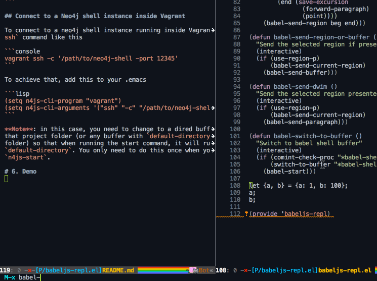

# Babeljs repl for emacs

# 1. Dependencies

- `babel`: `npm install -g babel`

# 2. Installation

## Melpa

Coming soon

## Manual install

- Clone it into your `.emacs.d` and add it into load path

```lisp
(add-to-list 'load-path "~/.emacs.d/babeljs-repl.el/")
```

- Load the library with `require`

```lisp
(require 'babeljs-repl)
```

# 3. Variables

Change these variables based on your demand

- `babel-cli-program`: the name of babel node cli program, default to
`babel-node`. Change it to absolute path if it's not in your load path.

```lisp
(setq babel-cli-program "/path/to/babel-node")
```

- `babel-cli-arguments`: the list of arguments to pass to `babel-node`.

- `babel-pop-to-buffer`: whether to pop up the babel shell buffer after sending
command to execute.

- `babel-pop-to-buffer-function`: the function used for pop up the neo4j shell
buffer if the above variable is set to t. Default is `pop-to-buffer`. An example
is `pop-to-buffer` to pop up the babel buffer to current window
instead of other window.

# 4. Commands

- `babel-start`: start a neo4j shell process
- `babel-send-current-region`: send the active region to neo4j shell process
- `babel-send-buffer`: send the whole buffer to neo4j shell process
- `babel-send-paragraph`: send the paragraph at point to neo4j shell process
- `babel-send-region-or-buffer`: send the current region if active, otherwise send
the whole buffer to neo4j shell process
- `babel-send-dwim`: send the current region if active, otherwise send the
paragraph at point to neo4j shell process
- `babel-switch-to-buffer`: switch to neo4j shell buffer if exist, otherwise,
start a new one

# 5. Tips

## Connect to a babel shell with option

```lisp
(setq babel-cli-arguments '("--trace-sync-io"))
```

# 6. Demo


